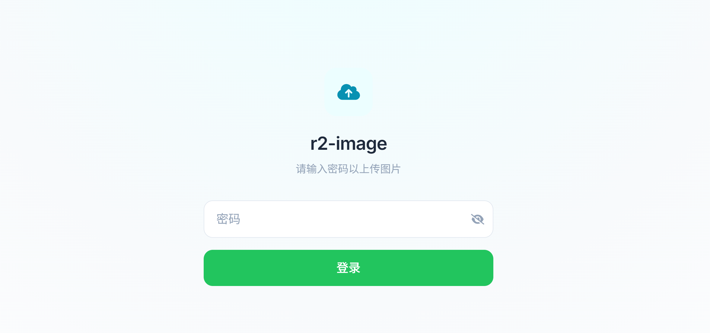
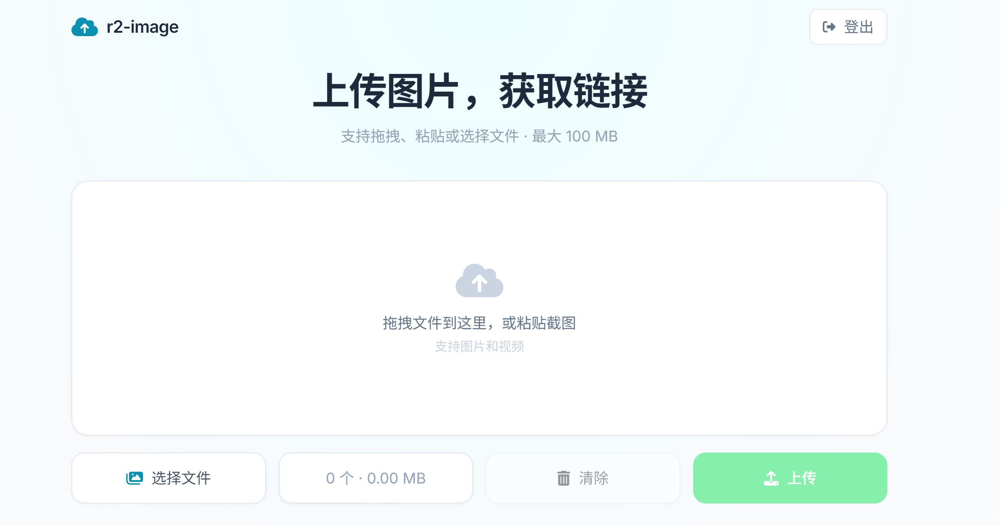
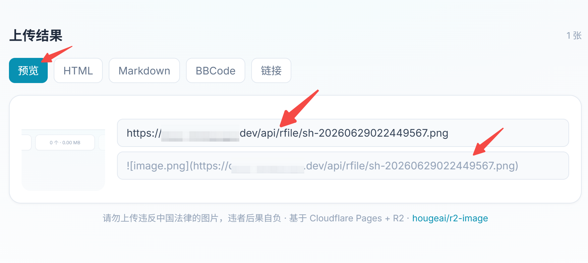

<div align="center">

# r2-image

**基于 Cloudflare Pages + R2 的免费图床，开箱即用**

[](https://nextjs.org/)
[](https://pages.cloudflare.com/)
[](https://developers.cloudflare.com/r2/)
[](https://tailwindcss.com/)
[](https://pages.cloudflare.com/)

极简图床 · 无限存储 · 密码鉴权 · 内容审查 · AI 编程工具集成

[功能特性](#功能特性) · [快速开始](#快速开始) · [接口文档](#接口说明) · [AI 集成](#ai-编程工具集成) · [致谢](#致谢)

</div>

---

> 基于 Cloudflare Pages + Cloudflare R2 对象存储的图床，仅保留上传图片并获取 URL 的核心功能，支持上传密码鉴权与可选的内容审查。

## 效果预览

<div align="center">
  
  <br/><br/>
  
  <br/><br/>
  
</div>

## 功能特性

- ♾️ **无限存储** —— 图片存于 R2 对象存储，不限数量
- 🆓 **完全免费** —— 托管在 Cloudflare 网络，免费额度内零成本
- 🌐 **免域名** —— 提供 `*.pages.dev` 二级域名，也支持自定义域名
- 🔒 **密码鉴权** —— 上传密码保护，防止他人恶意上传
- 🛡️ **内容审查** —— 可选鉴黄，自动拦截违规图片
- 🤖 **AI 集成** —— 内置 AI 编程工具技能包，自然语言即可上传

## 快速开始

本项目部署在 Cloudflare Pages + R2 上，完全免费。

📖 详细的分步图文教程见 **[部署指南](./docs/部署指南.md)**，涵盖：

- Fork 项目并创建 Cloudflare Pages 应用
- 设置 `nodejs_compat` 兼容性标志
- 绑定 R2 存储桶（变量名 `IMGRS`）
- 配置上传登录密码 `UPLOAD_PASSWORD`

> 需要图片内容审查（鉴黄）功能？见 [内容审查指南](./docs/内容审查.md)。

## 接口说明

| 路径 | 方法 | 说明 |
| ----------- | ----------- | ----------- |
| `/api/upload` | POST | 上传图片/文件，返回 JSON，其中 `url` 为访问地址（配置 `UPLOAD_PASSWORD` 后需登录） |
| `/api/rfile/{filename}` | GET | 通过文件名访问 R2 中的文件（带边缘缓存，公开访问） |
| `/api/login` | POST | 登录，body: `{"password":"密码"}`，成功写入登录 cookie |
| `/api/logout` | POST | 登出，清除登录 cookie |
| `/api/auth/check` | GET | 检查登录态，返回 `{requireAuth, authenticated}` |
| `/api/list` | GET | 列出 R2 中所有文件，需登录；支持游标分页 `?cursor=xxx&limit=100` |
| `/api/delete` | DELETE | 删除文件，需登录；body: `{"names":["xxx.png", ...]}`，支持批量 |

上传成功返回示例：

```json
{
  "url": "https://你的域名/api/rfile/xxx.png",
  "code": 200,
  "name": "xxx.png"
}
```

## AI 编程工具集成

项目根目录下的 [`skills/`](./skills) 文件夹内置了 AI Agent 技能包，无需额外编写——直接交给 AI 编程工具加载即可使用。集成后，你只需用自然语言对 AI 说"把这张图片上传到图床"，Agent 就会自动调用技能完成上传并返回 URL。

### 如何使用

1. **加载技能**：将本项目的 [`skills/`](./skills) 目录接入你的 AI 编程工具即可，各工具会自行识别并按其中的 `SKILL.md` 指令执行。

2. **配置环境变量**（AI Agent 运行时需要读取）：

| 变量 | 说明 |
|------|------|
| `R2_IMAGE_BASE_URL` | 图床域名，如 `https://xxx.pages.dev` |
| `R2_IMAGE_PASSWORD` | 上传密码（即 Cloudflare Pages 中配置的 `UPLOAD_PASSWORD`） |

```bash
export R2_IMAGE_BASE_URL="https://your-site.pages.dev"
export R2_IMAGE_PASSWORD="your-password"
```

3. **开始使用**：在 AI 编程工具中直接说，例如：
   - "把 `./screenshot.png` 上传到图床"
   - "上传这张图片并给出访问链接"

Agent 会自动登录图床、上传图片，返回形如 `https://你的域名/api/rfile/xxx.png` 的公开访问 URL。

## 致谢

本项目基于 [x-dr/telegraph-Image](https://github.com/x-dr/telegraph-Image) 改造，精简为仅使用 Cloudflare R2 对象存储的图床，感谢原作者的开源贡献。
