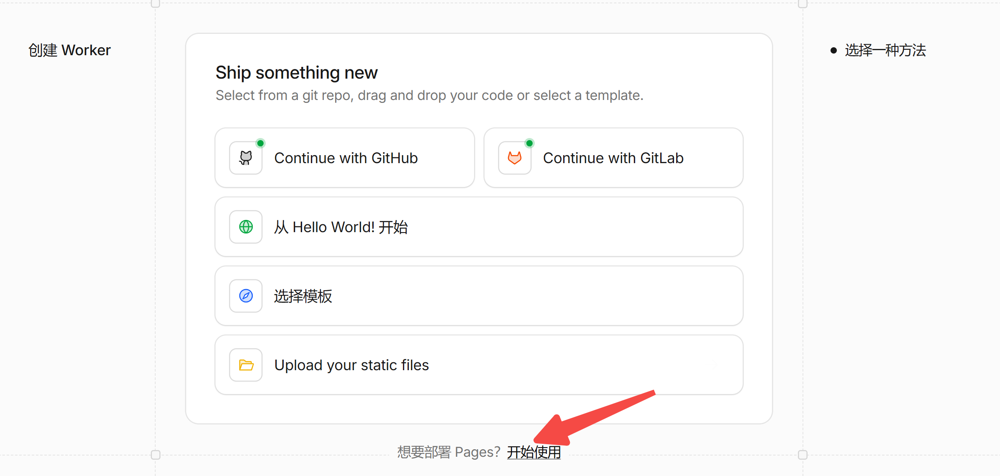
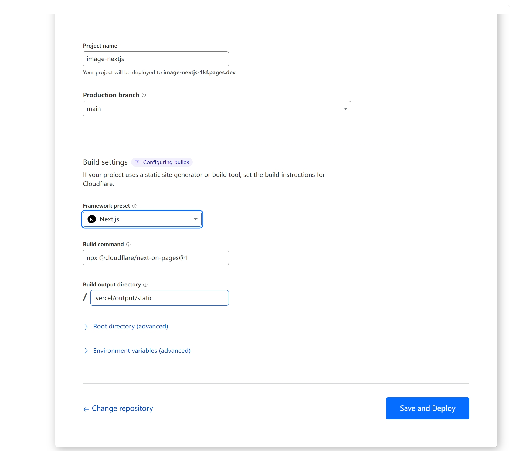
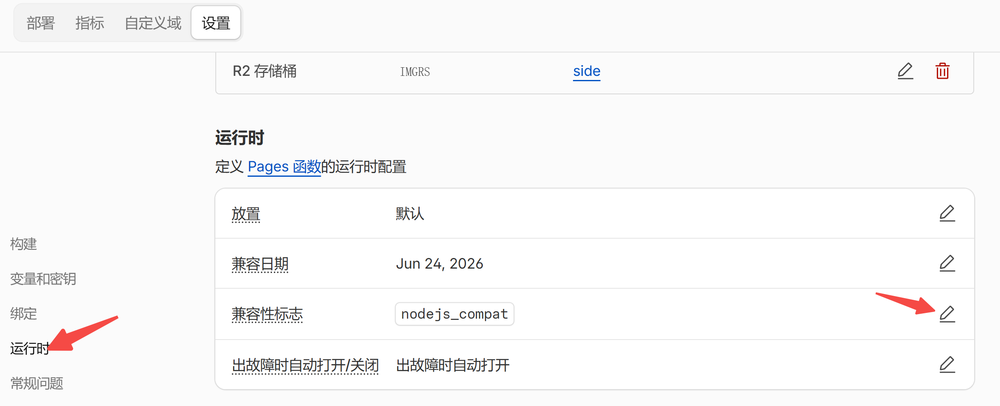
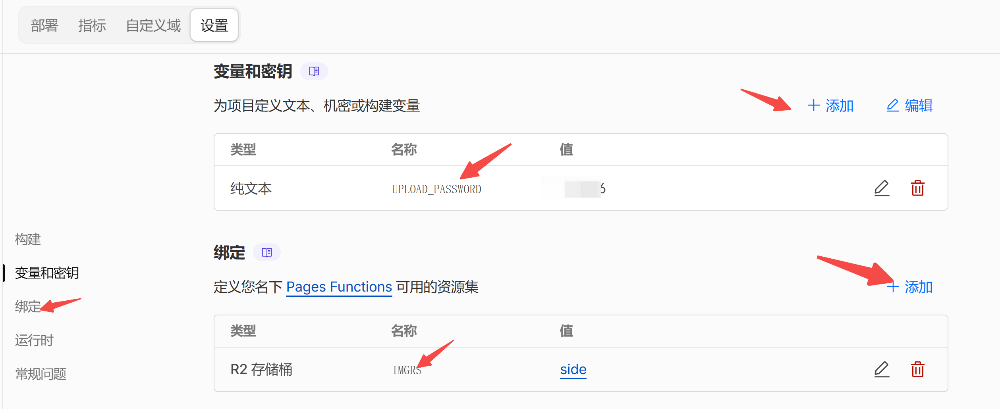

# 部署指南

本文档介绍如何将 r2-image 部署到 Cloudflare Pages，并完成 R2 对象存储绑定与上传密码配置。

## 利用 Cloudflare Pages 部署

1. 点击 [Fork](https://github.com/hougeai/r2-image/fork) 按钮将 [hougeai/r2-image](https://github.com/hougeai/r2-image) 复制到你自己的账号下。

2. 登录到 [Cloudflare](https://dash.cloudflare.com/) 控制台。

3. 在帐户主页中，选择 `pages` > `Create a project` > `Connect to Git`。

   

4. 选择你 fork 的项目存储库，在 `Set up builds and deployments` 部分中，`Framework preset(框架)` 选 `Next.js` 即可。
    

5. 点击 `Save and Deploy` 部署。

6. 设置兼容性标志：前往后台依次点击 `设置` -> `运行时` -> `兼容性标志` -> `配置生产兼容性标志`，填写 `nodejs_compat`。

   

7. 绑定 R2 存储桶（见下方 [配置 R2 对象存储](#配置-r2-对象存储)）。

8. 配置环境变量（见下方 [配置上传登录密码](#配置上传登录密码推荐防止他人上传)，可选的内容审查见 [内容审查指南](./内容审查.md)）。

9.  前往后台点击 `部署`，或者找到最新的一次部署点 `重试部署`（绑定 R2、兼容性标志、环境变量后需重新部署才能生效）。

## 配置 R2 对象存储

1. 在 Cloudflare 控制台创建一个 R2 存储桶（例如 `img`）。

2. 进入你的 Pages 项目，前往后台依次点击 `设置` -> `绑定` -> `添加`。

3. `变量名称` 填写 `IMGRS`，`R2 存储桶` 选择你刚才创建的存储桶，保存。

> 代码中通过 `env.IMGRS` 访问 R2 桶，因此变量名称必须为 `IMGRS`，否则上传/读取会报 `IMGRS is not Set`。

  

## 配置上传登录密码（推荐，防止他人上传）

在 Cloudflare Pages 项目 `设置` -> `环境变量` 中配置：

| 变量名称 | 值 | 说明 |
| ----------- | ----------- | ----------- |
| `UPLOAD_PASSWORD` | 你的密码 | 上传密码，未配置时使用默认密码 `pw`；建议部署后修改为自己的密码 |
| `AUTH_SECRET` | 随机字符串 | 可选，用于签名登录 token，不配则用 `UPLOAD_PASSWORD` 派生 |

> 登录态通过 httpOnly cookie 缓存在浏览器，有效期 365 天，同一浏览器下次打开无需重新登录。已上传图片的 URL 仍保持公开可访问（否则图片无法展示）。
